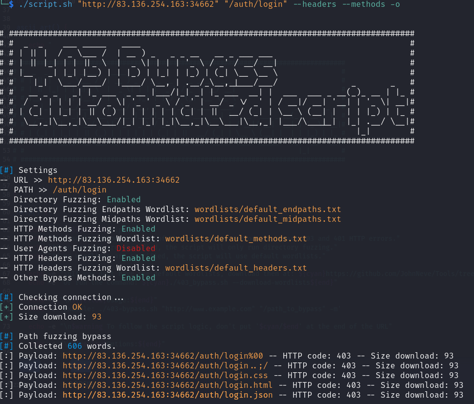

403-Bypass 
====

This is a simple script to automate attacks to bypass 403 and 401 HTTP forbidden errors.
  

Usage
----------
This script works with wordlists. You can use default wordlists by retrieving them with <code> ./403-bypass.sh --download-files </code> or specify others.
If no wordlists are specified, the script will use the default ones.

For example:

    ./403-bypass.sh "http://example.com" "/endpoint"

    ./403-bypass.sh "http://example.com" "/endpoint" -dir /custom_wordlist.txt --methods -o

Options
----------

- <code>-dir [endpaths_wordlist.txt] [midpaths_wordlist.txt]</code>: Use different wordlist(s) to perform directory fuzzing, considering that this tool manipulates the URL as follows: <b>http:/target.com:1337/midpaths/endpoint/endpaths</b>.

        ./403-bypass.sh "http://example.com" "/endpoint" --dir /custom_endpaths_wordlist.txt
  
        ./403-bypass.sh "http://example.com" "/endpoint" --dir /custom_endpaths_wordlist.txt /custom_midpaths_wordlist.txt

- <code>-u [wordlist]</code> | <code>--usragents [wordlist]</code>: Enable user agent fuzzing

        ./403_bypass.sh "http://www.example.com" "/endpoint" -u

- <code>-m [wordlist]</code> | <code>--methods [wordlist]</code>: Enable HTTP methods fuzzing

        ./403_bypass.sh "http://www.example.com" "/endpoint" --methods /path/to/wordlist.txt

- <code>-hd [wordlist]</code> | <code>--headers [wordlist]</code>: Enable HTTP headers fuzzing

        ./403_bypass.sh "http://www.example.com" "/endpoint" --headers

- <code>-o</code> | <code>--others</code>: Try other payloads:
      &nbsp;&nbsp;&nbsp;&nbsp; • URL characters alter case
      &nbsp;&nbsp;&nbsp;&nbsp; • HTTP version up(down)grade

        ./403_bypass.sh "http://www.example.com" "/endpoint" --others

- <code>-s</code> | <code>--skip</code>: Skip path fuzzing

        ./403_bypass.sh "http://www.example.com" "/endpoint" -u --methods --skip

- <code>--download-wordlists</code>: Download default wordlists

        ./403_bypass.sh --download-wordlists

- <code>-h</code> | <code>--help</code> | <code>--h</code>: Show help message and exit

        ./403_bypass.sh --help
